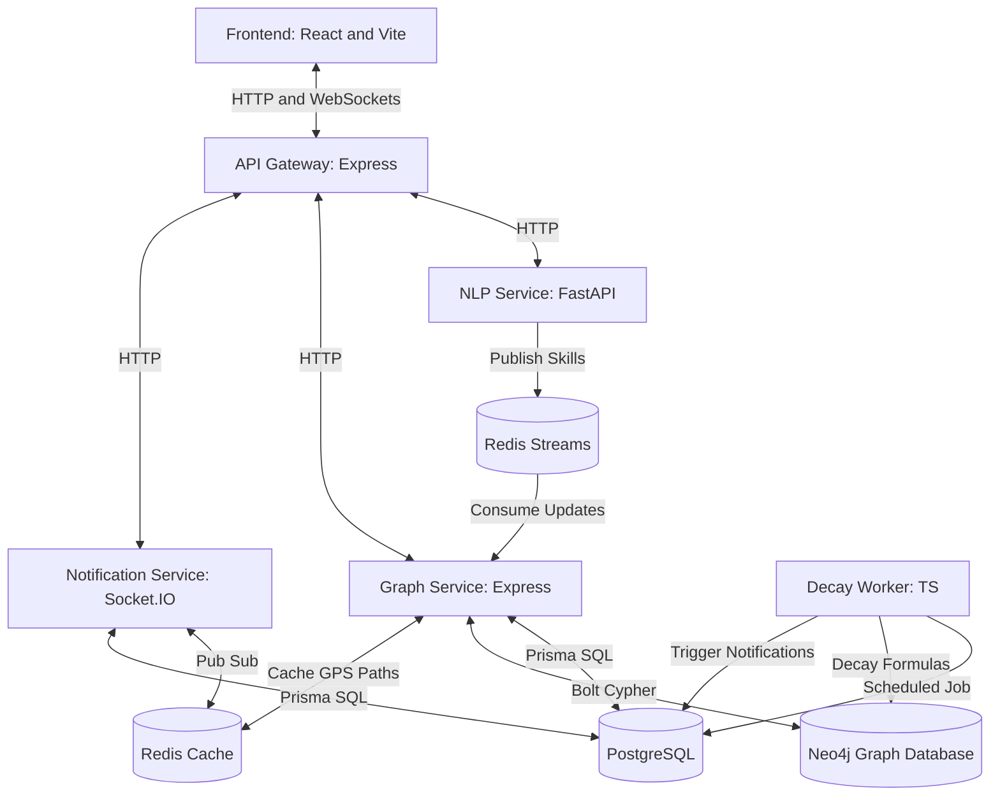

# SkillGraph

SkillGraph is a career navigation platform that reads your academic coursework and project repositories to show you exactly which industry roles fit your skills and what you need to learn next to get hired.

## Architecture



The system is designed as a microservice monorepo:
* **Frontend**: Renders the user dashboard, interactive skill profiles, and the 3D Skill Galaxy.
* **API Gateway**: Handles user authentication, route rate-limiting, and forwards requests to internal services.
* **NLP Service**: Extracts skill terms from project README files and repository metadata using text parsing.
* **Graph Service**: Manages student skill profiles and runs Neo4j Cypher queries to compute optimal career transition pathways (Career GPS).
* **Notification Service**: Manages persistent Socket.IO connections to push instant notifications to the client.
* **Decay Worker**: Periodically checks user inactivity and reduces skill proficiency weights if no commits or updates are registered for 12 months.

## Tech Stack

* **TypeScript and Node.js** (API Gateway, Graph Service, Notification Service, Decay Worker): Chosen to share type definitions across backend services and ensure high performance under asynchronous I/O workloads.
* **FastAPI and Python** (NLP Service): Selected to leverage Python's rich natural language processing ecosystem, specifically spaCy, while keeping the API endpoints fast and simple.
* **React 18 and Vite** (Frontend): Chosen for rapid build times, hot module replacement, and modern React rendering capabilities.
* **Neo4j community edition** (Graph Database): Used to execute Cypher queries and shortest-path graph calculations (Career GPS) efficiently, representing complex skill-to-job mappings natively.
* **PostgreSQL** (Relational Database): Used as the primary system of record for structured data like user credentials, profile records, and system settings.
* **Prisma ORM**: Provides type-safe database queries and declarative migrations, bridging PostgreSQL schemas directly into the TypeScript microservices.
* **Redis**: Acts as a multi-purpose middleware:
  * **Redis Streams**: Decouples the NLP extraction process from Neo4j updates via a message queue (graph:update:queue).
  * **Redis Pub/Sub**: Routes real-time notifications across the gateway and the notification socket instances.
  * **Redis Cache**: Caches computed Career GPS paths to avoid expensive graph traversal recalculations.
* **Socket.IO**: Powers real-time, low-latency communication to push skill decay alerts and matched career invites to active users.
* **D3.js and Three.js**: Utilized via react-force-graph-3d to render interactive, high-performance WebGL visualizations of the user's skill galaxy.
* **Tailwind CSS**: Chosen for quick, utility-first UI styling.

## How to Run Locally

### Prerequisites

* Node.js version 20 or higher
* Docker and Docker Compose installed and running on the host system

### Setup Steps

1. Install root and workspace dependencies:
   ```bash
   npm install
   ```

2. Generate the Prisma database client for the local environment:
   ```bash
   npm run db:generate
   ```

3. Spin up all application microservices and backing databases:
   ```bash
   npm run dev
   ```
   *Note: This command builds the service Docker files and runs database migrations on startup.*

4. Seed the database with sample profiles and skill structures (run in a separate terminal once services are healthy):
   ```bash
   npm run db:seed:docker
   ```

5. Verify the installation by running the workspace test suites:
   ```bash
   npm test
   ```

### Ports Exposed on Host

* Gateway API: http://localhost:3000
* Graph Service API: http://localhost:3001
* Notification Service: http://localhost:3002
* Frontend Application: http://localhost:5173
* NLP Service API: http://localhost:8001
* Neo4j Console: http://localhost:7474
* PostgreSQL Database: localhost:5432
* Redis Instance: localhost:6379

## Known Limitations

1. **Rule-Based Skill Extraction**: The NLP Service relies on a predefined gazetteer dictionary and regular patterns to extract skills, which makes it sensitive to typos and unable to detect semantic synonyms that are not explicitly registered.
2. **Simple Decay Cron Job**: The skill decay worker is built as a simple interval-based job inside a single worker container. It lacks advanced retry mechanisms, concurrency control, or job locks, which could lead to missed runs or execution overlap if scaled horizontally.
3. **Eventual Consistency between Databases**: User data is split between PostgreSQL (user profiles) and Neo4j (skills and connections). Updates are synchronized asynchronously via Redis Streams, meaning there can be brief periods of inconsistency if the graph database or message broker experiences latency.
4. **OAuth Callback Dependency**: Authentication is tightly coupled to external Google and GitHub OAuth configurations. If callbacks or env variables are misconfigured or external APIs go down, local logins/registrations are disabled.

## What to Do Differently

1. **Transactional Outbox Pattern**: Instead of writing to PostgreSQL and publishing to Redis Streams in separate, non-atomic application steps, implement the Outbox pattern. This would involve saving the event to an outbox table in PostgreSQL within the same database transaction, and using a Change Data Capture tool like Debezium to publish to the queue, ensuring reliable consistency.
2. **Hybrid NLP pipeline**: Enhance the skill extraction pipeline by combining spaCy tokenization with a lightweight, local Large Language Model (LLM) parser. This would allow the service to understand the context of how a skill was used in a project rather than relying on exact dictionary matches.
3. **Robust Job Scheduling**: Replace the basic custom interval worker with a production-grade distributed task framework like BullMQ (powered by Redis) or Temporal, enabling reliable task queuing, monitoring, automated retries, and rate limiting.
4. **Visual Regression Testing**: Add visual and integration testing suites using Playwright to automatically capture and verify the complex WebGL and canvas-based 3D Skill Galaxy components, preventing rendering failures during UI updates.
